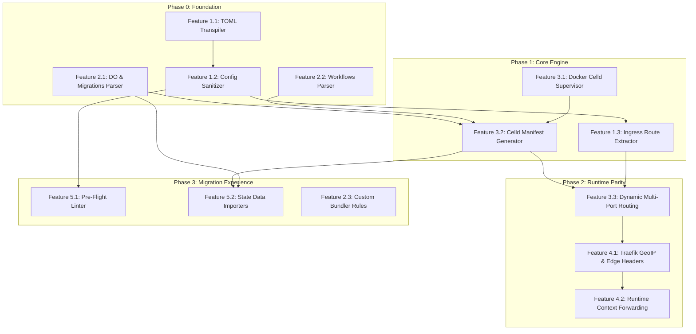

# Repository Planning Graph (RPG) PRD: Celld Compatibility & Cloudflare Migration

**Feature Slug**: `celld-compatibility-and-migration`  
**Status**: `Draft / Ready for Review`  
**Target Release**: `v1.1.0`  

---

## 1. Overview (`<overview>`)

### Problem Statement
Cloudflare Workers and Durable Objects are the premier edge serverless platform, but developers face vendor lock-in and high cloud costs. `celld` (by Deno Land) offers an open-source, bare-metal runtime for Workers and Durable Objects using S3-compatible storage (Garage) and V8 isolates. 

However, currently in **Cubit**:
1. Cloudflare configuration files (`wrangler.jsonc`, `wrangler.toml`) fail to deploy because `celld deploy` strictly errors out on top-level Cloudflare keys such as `routes` and `account_id`.
2. Cubit's Wrangler parser neglects key `celld` capabilities, omitting `durable_objects`, `migrations`, `workflows`, and `containers`.
3. The Docker supervisor for `celld` is stubbed out, and worker test runs rely on local Node.js emulation rather than real `celld` V8 isolate execution.
4. Developers migrating from Cloudflare have no pre-flight validation to know if their worker uses features unsupported by `celld` (e.g. Workers AI, Vectorize), nor any tools to migrate KV, D1, or R2 data.

### Target Users
- **Self-Hosted Infrastructure Engineers**: Running bare-metal or private cloud infrastructure desiring Cloudflare-compatible serverless compute.
- **Cloudflare Migrators**: Developers with existing Cloudflare Workers/DO apps seeking seamless zero-code-change migration onto self-hosted Cubit.

### Success Metrics
- **Zero-Config Deployment**: 100% of standard Cloudflare Workers using celld-supported bindings (Fetch, DO, KV, D1, R2, Queues, Workflows, Cron, Assets) deploy directly from GitHub or CLI without manual `wrangler.jsonc` edits.
- **Automatic Sanitization**: 100% of `routes` and `route` keys in `wrangler.jsonc`/`wrangler.toml` are automatically stripped and converted to Traefik ingress rules without throwing `celld` validation errors.
- **Execution Parity**: Deployed workers execute directly inside real `celld` V8 isolates with SQLite persistence and LTX replication.
- **Clear Pre-Flight Diagnostics**: 100% of unsupported Cloudflare features (Workers AI, Vectorize, Hyperdrive, Browser Rendering) are flagged with actionable diagnostics before build time.

---

## 2. Functional Decomposition (`<functional-decomposition>`)

```
Celld Compatibility & Migration
├── Capability 1: Config Sanitization & Transpilation (Wrangler Pre-Processor)
│   ├── Feature 1.1: TOML to JSONC Transpilation
│   ├── Feature 1.2: Cloudflare Key Sanitizer (Strip routes, account_id)
│   └── Feature 1.3: Ingress Route Extractor & Domain Registrar
├── Capability 2: Extended Manifest & Bindings Parser
│   ├── Feature 2.1: Durable Objects & Class Migrations Parsing
│   ├── Feature 2.2: Workflows & Containers Parsing
│   └── Feature 2.3: Esbuild Bundler Rules & Defines Support
├── Capability 3: Real Celld Fleet Orchestration & Zero-Downtime Deploy
│   ├── Feature 3.1: Docker Celld Container Supervisor
│   ├── Feature 3.2: Celld Manifest Generator (deploy/current.json & Reload)
│   └── Feature 3.3: Multi-Worker Port Allocation & Dynamic Ingress Sync
├── Capability 4: Edge Context & Geolocation Parity (request.cf)
│   ├── Feature 4.1: Traefik Ingress GeoIP & Edge Header Injection
│   └── Feature 4.2: Runtime Context Forwarding
└── Capability 5: Migration Assistant & Data Importers
    ├── Feature 5.1: Pre-Flight Compatibility Linter
    └── Feature 5.2: State Data Import Tooling (KV, D1, R2)
```

### Capability 1: Config Sanitization & Transpilation (Wrangler Pre-Processor)
Transforms raw Cloudflare configuration files into clean, strictly compliant `celld` configuration while extracting routing metadata.

#### Feature 1.1: TOML to JSONC Transpilation
- **Description**: Automatically transpile `wrangler.toml` files into valid `wrangler.jsonc` for `celld`.
- **Inputs**: Raw byte slice of `wrangler.toml`.
- **Outputs**: Formatted, valid JSONC/JSON string adhering to `celld` schema.
- **Behavior**: Parse TOML into typed intermediate structure, translate environment blocks (`[env.production]`), and serialize to JSONC.

#### Feature 1.2: Cloudflare Key Sanitizer
- **Description**: Intercept and strip all keys that `celld deploy` strictly rejects as fatal errors.
- **Inputs**: Parsed configuration structure or raw JSONC AST.
- **Outputs**: Sanitized configuration containing only celld-allowed keys (`name`, `main`, `compatibility_date`, `compatibility_flags`, `vars`, `durable_objects`, `migrations`, `kv_namespaces`, `d1_databases`, `r2_buckets`, `services`, `queues`, `workflows`, `triggers`, `assets`, `rules`, `define`).
- **Behavior**: Strip `routes`, `route`, `account_id`, `workers_dev`, `send_email`, `ai`, `vectorize`, `hyperdrive`, `browser` from the config passed to `celld`.

#### Feature 1.3: Ingress Route Extractor & Domain Registrar
- **Description**: Extract hostnames and path patterns from stripped `routes` and automatically register them with Cubit's Traefik ingress.
- **Inputs**: Extracted route strings (e.g. `api.example.com/*`, `*sub.domain.com/path*`).
- **Outputs**: Registered `domain.Domain` entities attached to the target application.
- **Behavior**: Parse wildcard route patterns into hostname and path prefixes, persist to database, and trigger `RouteSyncer.SyncRoutes`.

---

### Capability 2: Extended Manifest & Bindings Parser
Expands Cubit's internal domain and parser to represent the full suite of `celld`-supported bindings.

#### Feature 2.1: Durable Objects & Class Migrations Parsing
- **Description**: Parse `durable_objects.bindings` and `migrations` arrays from Wrangler configs.
- **Inputs**: `durable_objects` and `migrations` JSON/TOML nodes.
- **Outputs**: `domain.ResourceBinding` entries of type `durable_object` and persisted migration history.
- **Behavior**: Map class names, binding identifiers, and sqlite migration steps (`new_classes`, `renamed_classes`, `deleted_classes`).

#### Feature 2.2: Workflows & Containers Parsing
- **Description**: Parse `workflows` and `containers` bindings.
- **Inputs**: `workflows` and `containers` JSON blocks.
- **Outputs**: Resource bindings for workflows (`name`, `binding`, `class_name`) and container workloads.
- **Behavior**: Record bindings in `app.Bindings` with appropriate metadata.

#### Feature 2.3: Esbuild Bundler Rules & Defines Support
- **Description**: Support custom module rules (`Text`, `Data`, `CompiledWasm`) and compile-time `define` replacements.
- **Inputs**: `rules` array and `vars`/`define` maps in Wrangler config.
- **Outputs**: esbuild CLI bundling arguments passed during direct or Git-based builds.
- **Behavior**: Ensure `.wasm`, `.txt`, `.bin` imports resolve properly during bundle assembly.

---

### Capability 3: Real Celld Fleet Orchestration & Zero-Downtime Deploy
Replaces mock execution with real `celld` daemon processes in Docker, managing storage leases, LTX replication, and atomic updates.

#### Feature 3.1: Docker Celld Container Supervisor
- **Description**: Manage live `ghcr.io/denoland/celld:latest` containers across fleet nodes.
- **Inputs**: Node entity, container port specifications, Garage S3 endpoint, credentials, and bucket URL.
- **Outputs**: Running, healthy Docker containers with mapped public and internal ports.
- **Behavior**: Execute Docker commands or Docker engine API calls to launch celld with `--bucket`, `--endpoint`, `--region`, `--listen 0.0.0.0:<worker_port>`, `--internal-listen 0.0.0.0:<internal_port>`, and `--advertise <ip>:<internal_port>`. Send SIGTERM for graceful LTX log flushing on shutdown.

#### Feature 3.2: Celld Manifest Generator (`deploy/current.json` & Reload)
- **Description**: Generate `celld` deployment manifests with SHA-256 digests and issue zero-downtime hot reloads.
- **Inputs**: Compiled Worker bundle, static assets, sanitized Wrangler config, and target deployment ID.
- **Outputs**: Uploaded S3 manifest at `deploy/current.json` and HTTP 200 from `POST /reload` on celld internal listener (`:8081`).
- **Behavior**: Compute SHA-256 hash of bundles, format the JSON deployment specification, upload to Garage S3, and trigger reload on the celld internal port.

#### Feature 3.3: Multi-Worker Port Allocation & Dynamic Ingress Sync
- **Description**: Allocate discrete worker ports for deployed applications and route ingress traffic via Traefik.
- **Inputs**: Application ID, subdomain, custom domains, and assigned worker port.
- **Outputs**: Dynamic Traefik YAML configuration mapping domain rules to the target celld worker ports.
- **Behavior**: Update `traefik.yaml` dynamic routes whenever a worker's active deployment or domain configuration changes.

---

### Capability 4: Edge Context & Geolocation Parity (`request.cf`)
Ensures workers reading Cloudflare edge metadata do not crash or behave incorrectly.

#### Feature 4.1: Traefik Ingress GeoIP & Edge Header Injection
- **Description**: Inject standard Cloudflare edge headers at the Traefik ingress level.
- **Inputs**: Inbound client HTTP requests.
- **Outputs**: Injected headers: `CF-Connecting-IP`, `CF-IPCountry`, `CF-IPCity`, `CF-Ray`, `CF-Visitor`.
- **Behavior**: Traefik middleware derives IP and location (using local GeoIP database or proxy headers) and attaches headers before forwarding to celld.

#### Feature 4.2: Runtime Context Forwarding
- **Description**: Pass edge headers into the Worker request context.
- **Inputs**: Inbound HTTP request headers to celld.
- **Outputs**: Populated `request.cf` object available in `worker.fetch(request, env, ctx)`.
- **Behavior**: Worker bootstrap or wrapper synthesizes `request.cf` properties from the incoming `CF-*` headers.

---

### Capability 5: Migration Assistant & Data Importers
Provides developer tooling to validate compatibility and import data from Cloudflare.

#### Feature 5.1: Pre-Flight Compatibility Linter
- **Description**: Automated scanner for Cloudflare projects indicating whether they can run on `celld`.
- **Inputs**: Repository path or uploaded zip/bundle.
- **Outputs**: JSON/UI report listing supported features detected and any unsupported features found.
- **Behavior**: Scan `wrangler.jsonc` and source code imports. If unsupported APIs (e.g. `env.AI`, `env.VECTORIZE`, `env.HYPERDRIVE`, `@cloudflare/puppeteer`) are detected, display diagnostic remediation steps.

#### Feature 5.2: State Data Import Tooling (KV, D1, R2)
- **Description**: Endpoints and CLI helpers to ingest Cloudflare state dumps into Cubit.
- **Inputs**: `wrangler kv bulk get` export JSON, `wrangler d1 export` SQL dumps, or S3 credentials for R2 bucket migration.
- **Outputs**: Populated KV namespaces in Cubit/celld, executed D1 SQLite migrations/records, and replicated R2 objects in Garage.
- **Behavior**: Batch insert KV keys, execute SQL against D1 databases via `celld d1` or SQLite adapter, and copy S3 objects into Garage storage under `r2/<bucket>/`.

---

## 3. Structural Decomposition (`<structural-decomposition>`)

### Repository Structure
```
internal/
├── modules/
│   ├── wrangler/
│   │   ├── parser.go             # Extended schema (DO, workflows, containers)
│   │   ├── sanitizer.go          # Cloudflare key stripping & route extraction
│   │   ├── transpiler.go         # wrangler.toml -> wrangler.jsonc
│   │   └── validator.go          # Pre-flight compatibility linter
│   ├── deployment/
│   │   ├── service.go            # Manifest builder, S3 current.json writer, hot reload trigger
│   │   └── celld_manifest.go     # celld deployment schema encoder & digest hasher
│   └── service/
│       ├── migration_importer.go # Bulk KV/D1/R2 ingest handlers
│       └── handler.go            # Import endpoints
├── adapters/
│   └── out/
│       ├── docker/
│       │   └── celld_supervisor.go # Real Docker container runner & lifecycle monitor
│       └── traefik/
│           ├── file_provider.go    # Dynamic YAML writer with GeoIP headers
│           └── syncer.go           # Maps app subdomains to app celld ports
docs/
└── prd/
    └── celld-compatibility-and-migration.md
```

### Module Definitions

#### Module: `wrangler` (`internal/modules/wrangler`)
- **Maps to capability**: Capability 1 & Capability 2
- **Responsibility**: Parsing, sanitizing, transpiling, and validating Cloudflare configuration files.
- **Exports**:
  - `Parse(data []byte, formatHint string) (*WranglerConfig, string, error)`
  - `SanitizeForCelld(raw []byte) (sanitizedJSON []byte, extractedRoutes []string, err error)`
  - `TranspileTOMLToJSONC(tomlData []byte) ([]byte, error)`
  - `ValidateCompatibility(cfg *WranglerConfig, srcDir string) (*CompatibilityReport, error)`

#### Module: `deployment` (`internal/modules/deployment`)
- **Maps to capability**: Capability 3
- **Responsibility**: Building worker bundles, publishing `deploy/current.json` to S3, and invoking `POST /reload`.
- **Exports**:
  - `BuildCelldDeployment(ctx context.Context, app *domain.Application, dep *domain.Deployment) ([]byte, error)`
  - `TriggerCelldReload(ctx context.Context, internalPort int) error`

#### Module: `docker` (`internal/adapters/out/docker`)
- **Maps to capability**: Capability 3
- **Responsibility**: Docker container supervisor for running `ghcr.io/denoland/celld`.
- **Exports**:
  - `StartCelldContainer(ctx context.Context, appID string, workerPort, internalPort int, bucketURL, endpoint, region string) (string, error)`
  - `StopCelldContainer(ctx context.Context, containerID string) error`

---

## 4. Dependency Graph (`<dependency-graph>`)



---

## 5. Implementation Roadmap (`<implementation-roadmap>`)

### Phase 0: Foundation (Wrangler Parser, Sanitizer & Transpiler)
- **Goal**: Ensure any Cloudflare project configuration parses completely and is safely sanitized for `celld`.
- **Entry Criteria**: Existing `internal/modules/wrangler` test suite passing.
- **Tasks**:
  1. Add `DurableObjects`, `Migrations`, `Workflows`, `Containers`, `Rules`, and `Define` fields to `WranglerConfig`.
  2. Implement `SanitizeForCelld` to strip `routes`, `route`, `account_id`, and proprietary keys.
  3. Implement `TranspileTOMLToJSONC` to convert `wrangler.toml` into clean `wrangler.jsonc`.
- **Exit Criteria**: Unit tests verify that a Cloudflare `wrangler.toml` with `routes`, `durable_objects`, and `account_id` compiles to a valid `wrangler.jsonc` that `celld` schema accepts.

### Phase 1: Real Celld Fleet Orchestration
- **Goal**: Supervise real `celld` Docker containers and publish valid `deploy/current.json` manifests to Garage S3.
- **Entry Criteria**: Phase 0 completed; Docker daemon accessible.
- **Tasks**:
  1. Implement Docker client wrapper in `celld_supervisor.go` to launch `ghcr.io/denoland/celld:latest`.
  2. Implement `celld_manifest.go` to compute module digests and format `deploy/current.json`.
  3. Wire deployment pipeline in `deployment/service.go` to publish manifests and trigger `POST /reload`.
- **Exit Criteria**: Integration test verifies a sample DO worker boots in a real `celld` container and returns HTTP 200.

### Phase 2: Ingress & Edge Header Parity
- **Goal**: Route traffic dynamically via Traefik to worker ports and pass Cloudflare edge headers.
- **Entry Criteria**: Phase 1 completed; Traefik v3 container running.
- **Tasks**:
  1. Update `traefik/syncer.go` to route extracted routes and subdomains to app-specific worker ports.
  2. Add Traefik header middleware injecting `CF-Connecting-IP`, `CF-IPCountry`, `CF-Ray`.
- **Exit Criteria**: Request to `http://app.localhost` reaches `celld`, and worker logs show populated `request.cf.country`.

### Phase 3: Migration Experience & Data Importers
- **Goal**: Make migration 1-click with pre-flight checks and data import tools.
- **Entry Criteria**: Phase 2 completed.
- **Tasks**:
  1. Implement `validator.go` for pre-flight scanning of unsupported Cloudflare services.
  2. Implement bulk KV import (`wrangler kv bulk get` format).
  3. Implement D1 SQL dump importer endpoint.
- **Exit Criteria**: A Cloudflare repository with KV and D1 state can be imported and executed with zero code changes.

---

## 6. Test Strategy (`<test-strategy>`)

- **Unit Tests**:
  - TOML to JSONC transpiler with varied Cloudflare config fixtures.
  - Sanitizer regex/AST key stripper ensuring no prohibited keys remain.
  - SHA-256 manifest generator verifying digest format.
- **Integration Tests**:
  - Real Docker container boot test for `ghcr.io/denoland/celld`.
  - Deployment pipeline test against local Garage S3 bucket.
  - End-to-end HTTP request through Traefik into a celld worker isolate.
- **TDD Requirement**: All parser changes and manifest encoders must be developed test-first using table-driven Go tests.

---

## 7. Architecture & Decisions (`<architecture>`)

### ADR-001: Strict Scope to Native Celld Capabilities
- **Decision**: Cubit will strictly support features natively implemented in `celld` (Workers, Durable Objects, KV, D1, R2, Queues, Workflows, Cron, Assets).
- **Rationale**: Re-implementing Cloudflare's proprietary cloud offerings (Workers AI, Vectorize, Hyperdrive, Browser farms) creates maintenance debt and dilutes focus. Clear pre-flight diagnostics will guide developers to external API alternatives instead.

### ADR-002: Dynamic Sanitization of `routes`
- **Decision**: Intercept and strip `routes` before handing configuration to `celld`, translating them into Traefik ingress rules.
- **Rationale**: `celld deploy` strictly fails on unknown top-level keys. Stripping `routes` and delegating routing to Traefik preserves compatibility while keeping `celld` happy.

---

## 8. Risks & Mitigations (`<risks>`)

| Risk | Impact | Likelihood | Mitigation |
| :--- | :--- | :--- | :--- |
| `celld` rejects unexpected JSON formatting | High | Medium | Strict schema validation tests against `ghcr.io/denoland/celld` in CI. |
| Ingress port exhaustion on single host | Medium | Low | Port manager tracking dynamic port range (e.g. 10000-20000) with recycling. |
| Large SQLite D1 migrations take too long | Medium | Low | Run D1 migrations asynchronously with SSE streaming logs. |
