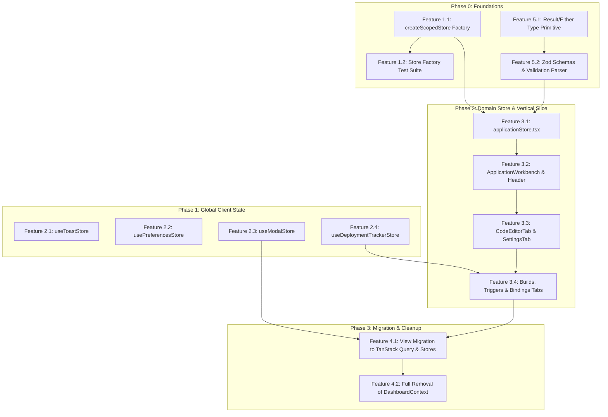

# Repository Planning Graph (RPG) PRD: 4-Tier Frontend State Architecture Refactor

**Feature Slug**: `frontend-state-refactor`  
**Status**: `Draft / Ready for Review`  
**Target Release**: `v1.2.0`  
**Related Map**: [#34](https://github.com/ishafiul/cubit/issues/34)  
**Related Decisions**: [#35](https://github.com/ishafiul/cubit/issues/35), [#36](https://github.com/ishafiul/cubit/issues/36), [#37](https://github.com/ishafiul/cubit/issues/37)  

---

## 1. Overview (`<overview>`)

### Problem Statement
Currently, `web/` state management is entangled across a monolithic `DashboardContext.tsx` (344 lines) and a massive `ApplicationDetailPage.tsx` (4,661 lines). 
1. **Unnecessary Re-renders**: Triggering an action or updating an input field re-renders entire component trees because actions and state are bundled together in single React Contexts.
2. **State Leakage Across Routes**: When navigating between different applications or workers, local state from the previous route can leak into the new route if not manually and error-prone-ly reset.
3. **Server Cache Pollution**: Server-fetched data (applications, nodes, domains) is coupled to UI state and refetch loops inside `DashboardContext`, leading to double-fetching, inconsistent cache synchronization, and boilerplate.
4. **Poor Modularity**: Critical features like the worker code editor, binding configurators, deployment logs, and metrics are held in one giant file without vertical slice organization.
5. **Ad-Hoc Form Validation & Error Handling**: Forms and client mutations lack schema validation and strongly typed error handling, relying on untyped `try/catch` blocks and manual string inspection.

### Target Users
- **Cubit Developers**: Frontend engineers building and maintaining UI features with clear state boundaries, fast unit testing, modular vertical slices, and type-safe validation.
- **Platform Operators**: Users interacting with real-time logs, code editors, and deployments who need instantaneous UI responsiveness without lagging or stuttering re-renders.

### Success Metrics
- **Zero Re-renders for Action Invocations**: Components invoking actions via `useActions()` execute with 0 additional re-renders when state changes.
- **Granular Subscriptions**: Subcomponents subscribing to specific slices via `useSelector` or shortcut hooks (e.g. `useActiveTab`, `useIsDirty`) re-render *only* when their subscribed slice changes.
- **Clean Route Lifecycle**: Navigating between applications guarantees full garbage-collection of domain state via `<ApplicationStoreProvider key={appId} ...>`.
- **Zero Server State Duplication**: Server data remains solely in `@tanstack/react-query` cache; Zustand stores strictly client modifications, uncommitted drafts, and UI preferences.
- **100% Decommissioning of DashboardContext**: All 7 modal states, deployment streaming, and server queries are decoupled into dedicated stores and direct TanStack Query calls.
- **Type-Safe Validation & Error Handling**: 100% of domain form inputs (environment variables, resource bindings, custom domains) are validated through Zod schemas returning an `Either`/`Result<T, E>` type instead of throwing exceptions.

---

## 2. Functional Decomposition (`<functional-decomposition>`)

```
4-Tier Frontend State Architecture Refactor
├── Capability 1: Scoped State Infrastructure & Factory
│   ├── Feature 1.1: Reusable Context-Scoped Store Factory (createScopedStore)
│   └── Feature 1.2: Store Factory Test Suite & Benchmarks
├── Capability 2: Global Client State Tier (Zustand Singletons)
│   ├── Feature 2.1: Toast Notification Store (useToastStore)
│   ├── Feature 2.2: User Preferences Store (usePreferencesStore with persist)
│   ├── Feature 2.3: Modal Coordinator Store (useModalStore)
│   └── Feature 2.4: Background Deployment Tracker Store (useDeploymentTrackerStore)
├── Capability 3: Domain Application State & Vertical Slice
│   ├── Feature 3.1: Scoped Application Store (applicationStore.tsx)
│   ├── Feature 3.2: Application Workbench & Header Components
│   ├── Feature 3.3: Modular Code Editor & Settings Tab Components
│   └── Feature 3.4: Builds, Triggers, Bindings & Metrics Tab Components
├── Capability 4: DashboardContext Decommissioning & View Migration
│   ├── Feature 4.1: View Migration (WorkersView, NodesView, DomainsView)
│   └── Feature 4.2: Full Removal of DashboardContext
└── Capability 5: Typed Validation & Either-Pattern Error Handling
    ├── Feature 5.1: Functional Either/Result Type Primitive (shared/utils/result.ts)
    └── Feature 5.2: Zod Schemas & Validation Parser (shared/utils/validation.ts)
```

### Capability 1: Scoped State Infrastructure & Factory
Provides a generic, high-performance generator for creating isolated, context-scoped Zustand stores with static actions and type-safe selectors.

#### Feature 1.1: Reusable Context-Scoped Store Factory (`createScopedStore`)
- **Description**: Build a generic factory function `createScopedStore<TState, TActions, TProps>` in `web/src/shared/stores/createScopedStore.tsx`.
- **Inputs**: Store initializer function `(props: TProps, set, get) => { ...state, actions: { ... } }`.
- **Outputs**: Strongly typed React Provider component, `useStore()`, `useSelector<T>(selector, equalityFn?)`, and `useActions()`.
- **Behavior**:
  - Uses `createStore` from `zustand/vanilla` instantiated inside a React `useRef` within the Provider.
  - Automatically garbage-collects store instance when Provider unmounts.
  - Keying Provider by domain ID (e.g. `<Provider key={id} ...>`) completely resets and rebuilds the store.
  - Enforces `actions` namespace in store structure.
  - `useActions()` selector returns `state.actions` directly; since actions are defined once and never reassigned, consumers of `useActions()` never re-render on state changes.

#### Feature 1.2: Store Factory Test Suite & Benchmarks
- **Description**: Comprehensive Vitest tests validating factory mechanics.
- **Inputs**: Test harness with dummy counter/draft stores.
- **Outputs**: Passing test suite.
- **Behavior**:
  - Verify two sibling providers maintain completely independent state.
  - Verify `useActions()` caller component does not re-render when state changes.
  - Verify selector components only re-render when their specific derived value changes.
  - Verify unmount cleans up internal subscriptions.

---

### Capability 2: Global Client State Tier (Zustand Singletons)
Manages app-wide, cross-route client state using lightweight global Zustand stores.

#### Feature 2.1: Toast Notification Store (`useToastStore`)
- **Description**: Global toast notification queue and dispatcher in `web/src/shared/stores/useToastStore.ts`.
- **Inputs**: Toast messages (`{ id, title, description, variant: 'success' | 'error' | 'warning' | 'info', duration }`).
- **Outputs**: Global store with `addToast`, `dismissToast`, `clearToasts`, and a companion `ToastContainer` UI primitive.
- **Behavior**: Auto-dismiss timers, persistent error toasts, zero server coupling.

#### Feature 2.2: User Preferences Store (`usePreferencesStore`)
- **Description**: Persisted user preferences in `web/src/shared/stores/usePreferencesStore.ts` using `zustand/middleware` `persist`.
- **Inputs**: Theme (`dark` | `light` | `system`), editor settings (tab size, word wrap), log stream auto-scroll, sidebar collapse.
- **Outputs**: Persisted store backed by `localStorage` under `cubit:preferences`.
- **Behavior**: Hydrates on load, provides granular selectors, keeps preferences across refreshes.

#### Feature 2.3: Modal Coordinator Store (`useModalStore`)
- **Description**: App-wide modal coordinator in `web/src/shared/stores/useModalStore.ts`.
- **Inputs**: Modal triggers (`openModal(name, props?)`, `closeModal(name)`).
- **Outputs**: State for `newApp`, `addNode`, `upgrade`, `newDomain`, `testingApp`, `historyApp`, `viewingCodeApp`.
- **Behavior**: Centralizes open/close states, isolates modal rendering from page layouts.

#### Feature 2.4: Background Deployment Tracker Store (`useDeploymentTrackerStore`)
- **Description**: Global tracker for background deployment tasks and EventSource SSE log streaming in `web/src/shared/stores/useDeploymentTrackerStore.ts`.
- **Inputs**: Deployment ID, status updates, streaming log entries.
- **Outputs**: Active deployment state, log buffer, connection lifecycle methods (`startStreaming`, `stopStreaming`).
- **Behavior**: Manages live SSE connection to `/api/v1/deployments/:id/logs/stream`, parses log events, and invalidates TanStack Query deployment lists upon completion.

---

### Capability 3: Domain Application State & Vertical Slice
Refactors worker workbench state into an isolated context-scoped store and decomposes the 4,661-line `ApplicationDetailPage.tsx` into clean vertical slice components.

#### Feature 3.1: Scoped Application Store (`applicationStore.tsx`)
- **Description**: Domain store in `web/src/features/applications/stores/applicationStore.tsx` using `createScopedStore`.
- **Inputs**: Initial route props (`appId`, initial active tab).
- **Outputs**:
  - `ApplicationStoreProvider`
  - `useApplicationSelector`
  - `useApplicationActions`
  - Shortcut hooks: `useActiveTab`, `useDraftCode`, `useIsDirty`, `useSecretVisibility`
- **Behavior**:
  - Tracks uncommitted code drafts, dirty state, selected tab, preview mode, and secret visibility.
  - Never mirrors server metadata (application name, bindings from server, deployments list).

#### Feature 3.2: Application Workbench & Header Components
- **Description**: Workbench container and action bar under `web/src/features/applications/components/`.
- **Inputs**: Selected Application from route params.
- **Outputs**:
  - `ApplicationWorkbench.tsx`: Root page wrapper providing `<ApplicationStoreProvider key={app.id}>`.
  - `WorkbenchHeader.tsx`: Deploy/Test triggers, status badge, breadcrumbs, using `useApplicationActions()`.

#### Feature 3.3: Modular Code Editor & Settings Tab Components
- **Description**: Interactive editor and configuration tabs.
- **Inputs**: Server application data and local drafts.
- **Outputs**:
  - `CodeEditorTab.tsx`: Integrates Monaco/CodeEditor, dirty indicator, save handler that triggers TanStack Query mutation and resets draft.
  - `SettingsTab.tsx`: Environment variables editor, wrangler preview, delete confirmation.

#### Feature 3.4: Builds, Triggers, Bindings & Metrics Tab Components
- **Description**: Remaining application detail tabs decoupled into dedicated vertical slice components.
- **Outputs**:
  - `BuildsTab.tsx`: Deployment history, active build status, rollback trigger.
  - `TriggersTab.tsx`: Crons and custom domain mappings.
  - `BindingsTab.tsx`: KV, D1, R2, Service, and Queue bindings managers.
  - `MetricsPanel.tsx`: Request rates, latency, and CPU metrics polling.

---

### Capability 4: DashboardContext Decommissioning & View Migration
Removes legacy `DashboardContext` and transitions all top-level views to direct TanStack Query hooks and global Zustand stores.

#### Feature 4.1: View Migration (`WorkersView`, `NodesView`, `DomainsView`)
- **Description**: Update top-level views and modals to eliminate `useDashboard()` dependencies.
- **Behavior**:
  - Direct consumption of Orval query hooks (`useListApplications`, `useListNodes`, `useListDomains`, `useGetRuntimeStatus`).
  - Cache invalidation via `useQueryClient()`.
  - Modal toggles via `useModalStore`.

#### Feature 4.2: Full Removal of `DashboardContext.tsx`
- **Description**: Delete `web/src/context/DashboardContext.tsx` and purge legacy context providers from `App.tsx`.
- **Behavior**: Ensure zero runtime regressions and all existing 48+ Vitest tests remain passing.

---

### Capability 5: Typed Validation & Either-Pattern Error Handling
Provides type-safe, functional error handling and runtime schema validation with Zod and the `Either` / `Result` pattern.

#### Feature 5.1: Functional Either/Result Type Primitive (`shared/utils/result.ts`)
- **Description**: Functional `Result<T, E>` / `Either` algebra without throwing exceptions.
- **Inputs**: Value or Error instances.
- **Outputs**:
  - `type Result<T, E = Error> = Ok<T> | Err<E>`
  - Constructors: `ok(value)`, `err(error)`
  - Type guards: `isOk(result)`, `isErr(result)`
  - Combinators: `map(result, fn)`, `mapErr(result, fn)`, `flatMap(result, fn)`, `match(result, { ok, err })`
- **Behavior**: Strict TypeScript discriminated unions (`{ ok: true, value } | { ok: false, error }`).

#### Feature 5.2: Zod Schemas & Validation Parser (`shared/utils/validation.ts`)
- **Description**: Validation helper and domain schemas using `zod`.
- **Inputs**: Raw form data or API response payloads.
- **Outputs**:
  - `validateSchema<T>(schema: z.ZodType<T>, data: unknown): Result<T, z.ZodError>`
  - Schemas: `environmentVariableSchema`, `resourceBindingSchema`, `domainSchema`, `applicationFormSchema`.
- **Behavior**: Safely parses untyped client inputs into typed domain records wrapped in a `Result`, preventing unhandled exceptions in UI workflows and store actions.

---

## 3. Structural Decomposition (`<structural-decomposition>`)

```text
web/src/
├── shared/
│   ├── stores/
│   │   ├── createScopedStore.tsx          # Reusable scoped-store generator
│   │   ├── createScopedStore.test.tsx     # Unit tests verifying isolation & zero re-renders
│   │   ├── useToastStore.ts               # Global toast singleton
│   │   ├── usePreferencesStore.ts         # Global preferences singleton (persist)
│   │   ├── useModalStore.ts               # Global modal coordinator singleton
│   │   └── useDeploymentTrackerStore.ts   # Global deployment & log streaming singleton
│   ├── utils/
│   │   ├── result.ts                      # Either / Result functional type & combinators
│   │   ├── result.test.ts                 # Result algebra unit tests
│   │   ├── validation.ts                  # Zod validation schemas & validateSchema()
│   │   └── validation.test.ts             # Validation unit tests
│   └── components/
│       └── ToastContainer.tsx             # Global toast UI renderer
│
├── features/
│   └── applications/
│       ├── api/                           # TanStack Query generated hooks & custom queries
│       ├── stores/
│       │   ├── applicationStore.tsx       # Scoped domain store
│       │   └── applicationStore.test.tsx  # Domain store unit tests
│       ├── components/
│       │   ├── ApplicationWorkbench.tsx   # Root workbench wrapper with Provider
│       │   ├── WorkbenchHeader.tsx        # Action bar & deployment triggers
│       │   ├── tabs/
│       │   │   ├── OverviewTab.tsx
│       │   │   ├── CodeEditorTab.tsx
│       │   │   ├── BuildsTab.tsx
│       │   │   ├── TriggersTab.tsx
│       │   │   ├── BindingsTab.tsx
│       │   │   └── SettingsTab.tsx
│       │   └── MetricsPanel.tsx
│       └── hooks/
│           └── useWranglerParser.ts       # Extracted helper hook for config preview
```

---

## 4. Dependency Graph (`<dependency-graph>`)



---

## 5. Verification & Test Strategy (`<verification-strategy>`)

1. **Unit Testing (`vitest`)**:
   - `createScopedStore.test.tsx`: Test that two parallel `<Provider>`s have isolated state, `useActions()` reference is strictly stable across state transitions, and `useSelector` only triggers re-renders on relevant slice mutations.
   - `result.test.ts`: Test `ok`, `err`, `map`, `flatMap`, `match` combinators.
   - `validation.test.ts`: Test validation against valid and invalid schemas returning `Result`.
   - `applicationStore.test.tsx`: Test initial state, draft updates, dirty tracking, reset action, and tab switching.
   - `usePreferencesStore.test.ts`: Test that updates write to `localStorage` and hydrate properly.
2. **Component Integration Testing**:
   - Test rendering of `ApplicationWorkbench` with mock TanStack Query responses.
   - Verify typing in `CodeEditorTab` marks `useIsDirty()` true while leaving `WorkbenchHeader` un-rendered.
3. **Regression Test Suite**:
   - Run `npm --prefix web test` to guarantee all existing tests continue passing without error.
4. **Type Check & Build**:
   - Run `npm --prefix web run build` (`tsc && vite build`) to guarantee strict zero TypeScript errors.

---

## 6. Risks & Mitigations (`<risks-and-mitigations>`)

| Risk | Impact | Mitigation |
| :--- | :--- | :--- |
| **Monolithic diff during ApplicationDetailPage refactoring** | High | Decompose by tabs (`tabs/OverviewTab.tsx`, `tabs/CodeEditorTab.tsx`, etc.) incrementally, preserving subcomponent interfaces and behavior. |
| **Memory leaks with SSE EventSource** | Medium | Centralize EventSource lifecycle in `useDeploymentTrackerStore` with strict teardown in unmount hooks. |
| **Stale draft collisions** | Low | Draft state is kept purely in-memory and keyed to application ID; provider unmount completely discards uncommitted drafts. |
